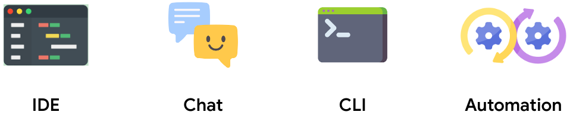

A number of ways exist to interact with generative AI, the ones that spiring to most peopls minds are chat or within the IDE.



This is a prtotype CLI, that can be used standalone to included in automation workflows (CI/CD for example), that has GenAI integrated. It is a go variant of an open source 20% project I am involved in ([genai-for-developers](https://github.com/GoogleCloudPlatform/genai-for-developers)).

NOTE: The original version of this from Sept 2023 was called `buildey`, to streamline this is the first step to migrate `buildey` to a Go version of `devai`. (initial demo used at an event was [coffee-and-codey](https://gitlab.com/robedwards/coffee-and-codey) and v1 of the [buildey](https://gitlab.com/robedwards/buildey) CLI)


## Usage

The command `devai` or `buildey` (/bin/devai) can be used to to do varios tasks like;
* Code review
* Create readme's
* Create release notes
* .......

Some local demo apps/code can be found in ([./demo/](./demo/)).

```
bin/devai -h
A CLI to leverage GenAI to help with common developer activities.

buildey could be used standalone or embedded into CI workflows to assist 
humans and do heavy lifting to improve productivity and help with all 
those things we know are important.
Thinks documentation, code reviews, QA, performance etc.

Usage:
  buildey [flags]
  buildey [command]

Available Commands:
  document    Create various types of docuemntation
  help        Help about any command
  info        Info command and test
  inspect     A .....
  release     A brief description of your command
  review      A number of options to assist with reviews of certain aspects of code

Flags:
  -d, --debug     Display debugging output in the console. (default: false)
  -h, --help      help for buildey
  -v, --verbose   Display more verbose output in console output. (default: false)
      --version   version for buildey

Use "buildey [command] --help" for more information about a command.
```

## Structure 

The following strucure was selected to aid with;

* **Code Reusability**: Avoids code duplication by centralizing shared functionality.
* **Maintainability**: Makes it easier to update and test shared code in one place.
* **Modularity**: Encourages better organization and separation of concerns.
* **Testability**: Shared packages can have their own unit tests.


```
devai/
├── cmd/
│   ├── root.go
│   ├── echo/
│   │   ├── echo.go
│   │   └── flags.go (if needed)
│   ├── release/
│   │   ├── release.go
│   │   └── ...
│   └── review/
│       ├── review.go
│       └── ...
├── pkg/
│   ├── utils/
│   │   ├── helpers.go
│   │   └── ...
│   └── config/
│       ├── config.go
│       └── ...
├── go.mod
├── go.sum
└── README.md
```

* `cmd/`: Remains the same, housing your root command and subcommand directories.
* `pkg/`: This is where you'll place shared packages that can be imported by multiple subcommands (or even other parts of your project).
  * `utils/`: A common package for utility functions, like string manipulation, data validation, logging, etc.
  * `config/`: A package for handling configuration loading, parsing, and access (using Viper or similar).
  * Other Packages: You can create more packages as needed, e.g., `api/` for interacting with external APIs, `db/` for database access, etc.


  ## Development

  
  ```
  go run main.go
  go run main.go --help
  go run main.go review code
  ```


  Migrate `buildey` to `devai` from [inital experiments](https://gitlab.com/robedwards/buildey.git).
